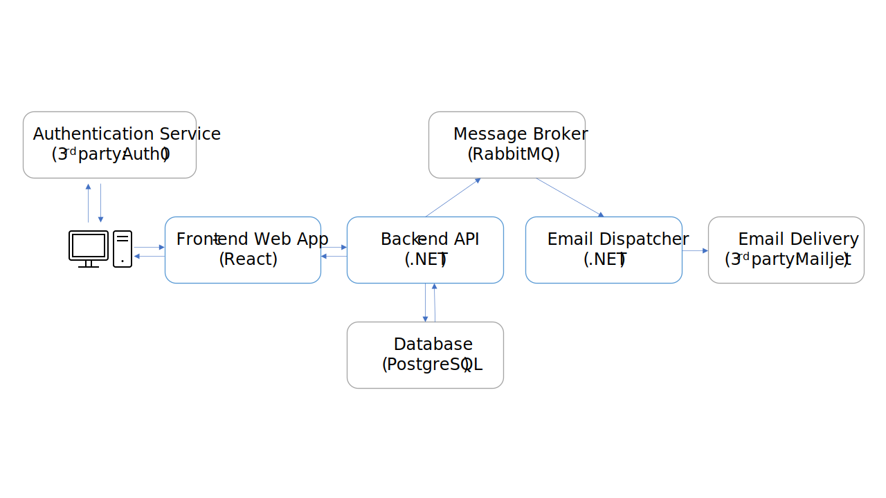
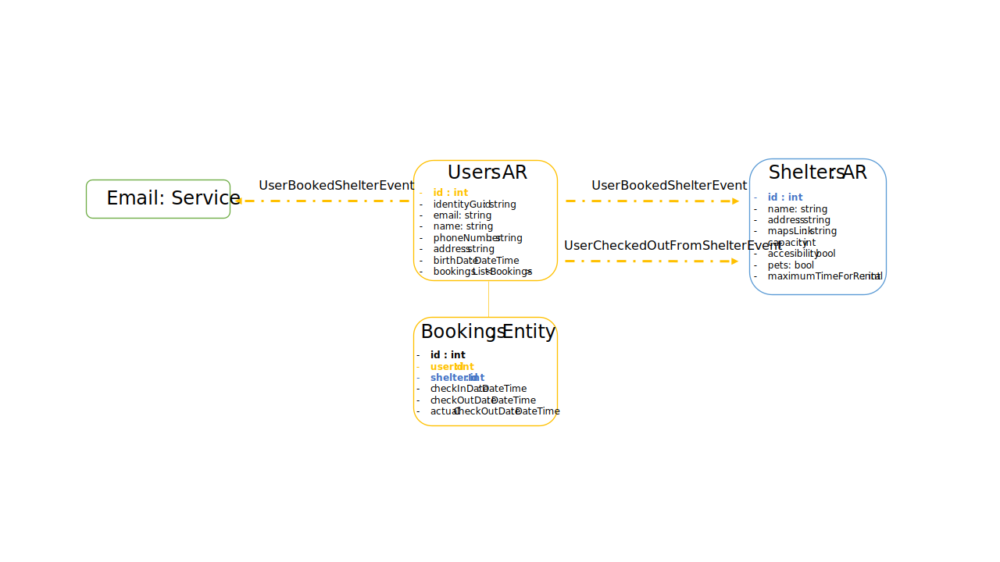

# PWeb-IDP Project: Shelters

## PWeb

### Wireframes and Prototypes

[Figma link](https://www.figma.com/file/qQcphiNVE02Ln8sRaXpwRV/PWeb-Final?node-id=2%3A3)

### User Stories

- As an **administrator** I would like to be able to:
  - **Add shelters**, by providing their **name**, **address**, **Google Maps link**, **max. capacity**, **facilities** and **max. check-in days**
    - If needed, I want to **edit** any **shelter**
    - If needed, I want to **delete** any **shelter**, provided they are **not booked** by any **user**
  - **Edit** the profile of any registered **user**
  - **Extend accommodation** and **force check-out** on behalf of any **user** 
  - **Delete user** profiles, provided they are **not currently checked-in** at any **shelter**
  - **View** and **filter** **shelters** and **users**
  - **View accommodation history** for any **user** 
  - **View details** for specific **shelters**:
    - **Metrics** such as: **current number of refugees** and **average age of the refugees**
    - **All sheltered users**, including their name, email address and phone number
  - **View overall metrics** for **shelters**:
    - **Metrics** should be **evolution of sheltered refugees over time**, **age distribution**, and **top X current shelters with most refugees**.

- As a **user** I would like to be able to:
  - **Access** the platform
  - **Setup** a **profile**, comprised of **name**, **email**, **phone number**, **address** and **birth date**
  - **View** my profile data
  - **Edit** my profile data
  - **View** all the **shelters** in the platform
  - **Check-in** an available **shelter** for a **certain number of days**, provided that the **shelter** is **not fully booked**, and I am **not currently checked-in** elsewhere
  - **Extend** the **accommodation period** for the **shelter** that I am currently staying in
  - **Receive** a **welcome email** every time I check-in
  - **View** the **remaining time** of my **accommodation period**
  - **View** my **accommodation history**
  - **Check-out** at any time

### Macro Architecture

### Entities

### Test Credentials

- Admin user:
  - Email: `admin@example.com`
  - Pass: `Montague123`

- Normal user:
  - Email: `user@example.com`
  - Pass: `Montague123`

## IDP

*TODO?*
